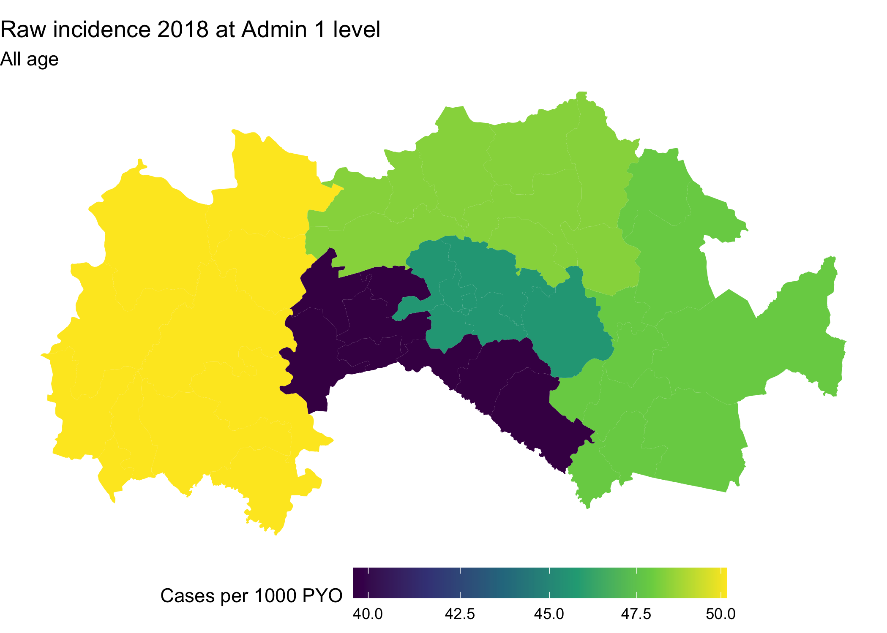
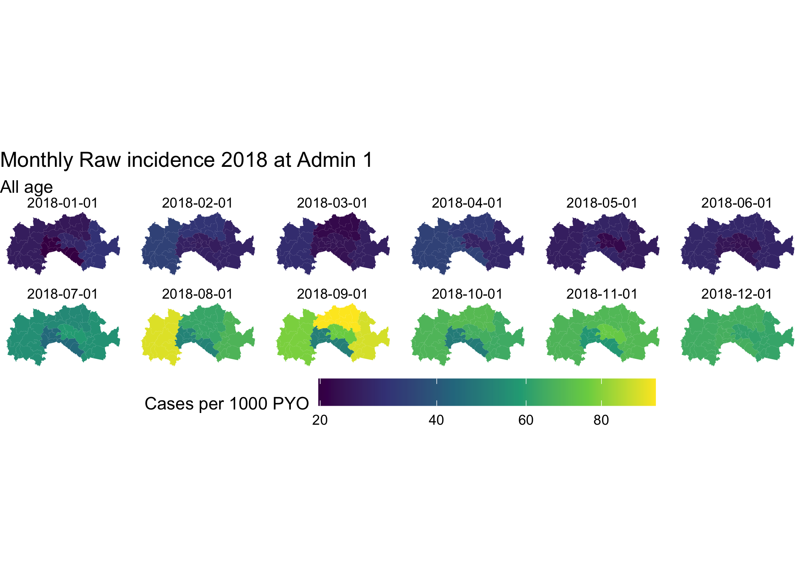

```{r setup, include = FALSE}
knitr::opts_chunk$set(echo = TRUE, message = FALSE, warning = FALSE, fig.align = 'center', cache = TRUE)

```


```{r, include=FALSE}
# save the built-in output hook
hook_output <- knitr::knit_hooks$get("output")

# set a new output hook to truncate text output
knitr::knit_hooks$set(output = function(x, options) {
  if (!is.null(n <- options$out.lines)) {
    x <- xfun::split_lines(x)
    if (length(x) > n) {
      # truncate the output
      x <- c(head(x, n), "....\n")
    }
    x <- paste(x, collapse = "\n")
  }
  hook_output(x, options)
})
```


\vspace{14pt}
\renewcommand\contentsname{}
\setcounter{tocdepth}{3}
\hrule
\tableofcontents
\vspace{20pt}
\vspace{18pt}
\hrule


# 1.1 General overview and learning objectives

## *1.1.1 Aim*

This module aims to provide an overview on common practices in managing public health data. We will review common health data sources, data collection methodologies which may result to different data types, then discuss the main steps of the data management cycle from design of a study or an information system, collection, extractions, entry, manipulation, summarization, analysis,  visualization, and interpretation and use. 

We will review common practices of data handling using *Spreadsheet programs* e.g., using *MSExcel, Calc* for basic data management such as dealing with missing data, detecting and correcting outliers and errors, joining/merging files, summarizing and visualization. Discussing their pros and cons, then briefly introduce the benefits of using reproducible approaches when managing data. Detaials of these approaches and tools will be learnt in other Modules.  

The module contains hands-on practicals and class activities in order to put the theoretical knowledge into practice.

## *1.1.2 Time*

This section is expected to take a maximum of 2 hours split into three steps: 

* Presentation of materials from facilitators/trainers - emphasized to be interactive;
* Class activities including plenary discussions;
* Individual activities.

Most activities will be done during the session, however, participants are encouraged to do extra practices to improve their skills and learning outcomes. 

# 1.2 Definition of terms

Let's revisit and refresh on few terms commonly referred to when talking about public health and data. 

**Health**

The World Health Organization (WHO) defined health in its 1948 constitution as “a state of complete physical, mental and social well-being and not merely the absence of disease or infirmity.” (WHO Constitution, 1948) 

**Public Health**

The “art and science of *preventing disease*, prolonging life and *promoting health* through the organized efforts of society” (Acheson, 1988; WHO)

The “the *science* and art of preventing disease, prolonging life, and promoting health through the organized efforts and *informed choices* of society, organizations, public and private communities, and individuals.” (CEA Winslow, CDC)

The revised definition (by CDC) has some additional terms: *Science* and *informed choices*. Let's look at few of them: 

What is **Science**?

Several definition exists, a common one includes *... the pursuit and application of knowledge and understanding of the natural and social world following a systematic methodology based on evidence.*

  + Scientific methodology e.g., observation, experimental investigation;
  + Measurements - identification, description, indicators;
  + Data; 
  + Evidence:
  + Theoretical explanation.

What is an **informed choice**?

  + Decisions that are consistent with their goals and values;
  + Unbiased;
  + Evidence-based information;
  + Provide several options.

Now it unfold to the core components: 

**Data** 

Facts or collection of facts about something that can be used for reasoning, making decision or planning, e.g., for public health. Once processed, organised and put into context data can generated information that is a great input for decision making process, to draw a conclusion, make predictions. 

**Public health (surveillance) data**

Data that can be used to evaluate impact or monitor progress e.g., of a health program or interventions, give information that help to determine appropriate public health interventions, to determine populations at risk, where to target interventions, to determine success, gaps, challenges, guide public policy and practices.

**Data management**

This refers to the entire process from the time the data is captured/collected to the point it is utilized for decision-making process. 

See Figure 1. 

```{r, out.width="80%", echo=FALSE}

knitr::include_graphics("images/Data_Management_Flowchart_v3.jpg")

```

Looking at this Figure, we are saying, in other words, Data Management is everything that supports a program/project “data lifecycle” steps; the architectures, policies, practices and procedures.

We will come back to this later. 

# 1.3 Public health data

## *1.3.1 Sources*

Public health data may originate from various sources including the following:

+ *Routine* disease surveillance data;
  - Medical/clinical records - diseases/conditions (outpatients, admissions), births, deaths that happens in the care delivery facilities (in some cases also at community) 
  - Service data - medicines/supplies available/used, tests/procedures, medical devices.  These data may be captured electronically or paper-based.
+ *Research* and surveys: e.g., DHS, MIS, MICS, AIS, SPA and others;
+ *Administrative*, e.g., human resources, finances and other logistic data;
+ *Vital statistics* - this may overlap with routine data, but may include events captured by the vital registration systems happening at facilities and communities;
+ *Census*; and,
+ *Literature.* - gray and published

No matter where your data comes from, always be sure to check that it is of good quality - valid, complete, and clean - before analyzing and utilizing.

## *1.3.2 Usefulness and utilization*

Data plays a vital part of health research and practice. Properly managed health data will help to provide us with unbiased information. 

Where available public health data may be used to understand the health status of the population, patterns and trends of diseases, assess if the interventions in place are working and guide practical and policy decisions.

Important questions public health can be used to answer include the following:

- **Who** is mostly affected? e.g., subpopulation?
- **Where** is mostly affected? e.g., areas, locations, subunits at microlevel (spatial units). 
- **Why** is mostly affected?  *how* or the *factors* associated to the events
- **When** is the most effect? Temporal trend? Seasonal patttern? 
- **At what extent**?
- **What direction**? e.g., river flow

## *1.3.3 Data and system challenges*

Due to heterogeneity in nature of data journey, sources, methods of collection, and volume, public health data encounter a number of constraints which may influence its utilization. 

These are sometime refers as Data quality dimensions and may include but not limited to the following attributes:

 - *Completeness* - captured but not reported;
 - *Timeliness* - late reported;
 - *Availability* - captured, reported but not accessible for use;
 - *Incomplete*/poor recording - some important variables or attributes not captured;
 - Consistency - Always tells the similar fact/story;
 - Aggregated - masked important information relevant for decision; and
 - *Big data* - an *ambiguous* dimension. 
 
 Lets explore a bit about **Big data**. 
 
 Main characteristics include: 
 
  - *Volume*: the amount of data collected at once;
  - *Velocity*: the rate at which data comes in - e.g., weekly malaria surveillance data;
  - *Variety*: many types of data. Ref: Routine surveillance data discussed earlier;
  
Other features includes *Veracity* - the quality of the data, the accuracy, do we have it all? And lastly, *Value* - do we have the ability to transform this mountains of data into useful information for use? 

Take note of these characteristics when discussing a need for real-time surveillance data, daily, weekly vs. its management. 

Arguments that it is probably better to have *minimal useful data* in real time and best utilized than *lots of data* at a low speed and poorly utilized. Your choice! 

As the data grow bigger  more skills and tools are requires to manage it. 

# 1.4 Data management proccess

Data management is a process with various steps. 

Let's re-visit the previous graphical presentation of the Data Management Cycle

```{r, out.width="80%", echo=FALSE}

knitr::include_graphics("images/Data_Management_Flowchart_v3.jpg")

```

The steps go from Study design (incl Protocol, tools and databases), data collection, cleaning/validation, organizing (creating metadata, new variables) and quality control checks, storage, security (confidentiality - different datasets for different purposes, protection/access, sharing protocols/agreements), data analysis, presentation and interpretation of results/information generated from data, data use/reuse.

The main goal of managing your data is to generate information that will  provide useful and probably sufficient evidence that gives right and needed knowledge to the right stakeholders for the purpose of answering the research/policy questions or guide decisions needed to have an impactiful and effective surveillance system. 

Note: 

- Data and Information are used interchangeable - but they dont mean the same thing; Information is in most cases derived from Data.
- Data can be reused several times for several purposes. Keep an open mind when it comes to data use. 
- Variations on skills to analyse and manipulate may hinder this fully utilization.
- Integration is important and should be considered:linking and combining data from other sources to optimize insights and evidence generation.
- Publishing:some data are made accessible to public (at cost or freely). Consider this - your data may be useful to several stakeholders. 

## *1.4.1 Data manipulation using Spreadsheet*

This sub-section will focus on few common practices used duirng data manipulation. 

** Reading the data file ** 

> ### Task 1 {.challenge}
> - Import the `routine_data.csv` file using the `read_csv()`  function
> - Explore the data (call the object/name assigned) using functions such as `str()`, `head()` and `summary()`
> - Check the records of adm1 and year
> 
> <details>
> <summary markdown="span">Solution</summary>
>  
> ```{r, readingdatafile, answer=TRUE, eval=TRUE, purl=FALSE}
> library(tidyverse)
> library(lubridate)
> dat0 <- read_csv("data/routine_data.csv")
> str(dat0)
> head(dat0)
> summary(dat0)
> 
> with(dat0, table(unique(adm1)))
> with(dat0, table(unique(year)))
> 
> ```
> </details>

**Data - routine_data.csv:**

The file *routine_data.csv* (in Data your folder) contains simulated routine malaria cases for a certain *Fakeland*. Files (with extension *.csv) can be opened using MSExcel program. The data contains monthly facility-based reported tested and confirmed malaria cases for under fives and adults (over 5s) populations for year 2018. The file has a total of `r nrow(dat0)` observations, with a total of `r dplyr::n_distinct(dat0$adm1)` Admin 1 and `r dplyr::n_distinct(dat0$adm2)` Admin2 units, and `r dplyr::n_distinct(dat0$hf)` health facilities. 


** Reviewing and cleaning the data ** 

Scanning through the data variables (or checking the output of `summary()` and `with(dat0, table(unique(adm1)))`) we have observed the following: 

- Year recorded as 18 (in 12 instances) and 3018 (in 12 instances);
- Records of the variable *test_u5* include *NA* and *-9999*
- Names of Admin 1; e.g., *"North Coast"* recorded as  *"N. Coast"*;

Some of these seems like obvious errors/typos and can be easily corrected. 

To do this in a spreadsheet we can apply *Find and Replace*"* or *filter* options to the data and the variable with mistakes (at least to avoid searching the entire file) then do the needed corrections.


Refer to the *Module 1 SlideDeck* for Details. 


> ### Task 2 {.challenge}
> - Import the `routine_data.csv` file using the `read_csv()`  function
> - Clean the obvious errors in Adm1 names, year records
> - In the variable *test_u5* set -9999 values to NA
> - Convert the variable "month" to an ordered factor
> - Export and save the cleaned datafile using the  `write_csv()` function
>  
> <details>
> <summary markdown="span">Solution</summary>
>  
> ```{r, answer=TRUE, eval=TRUE, purl=FALSE}
> dat0 <- read_csv("data/routine_data.csv")
> dat0$month <- factor(dat0$month, levels = month.abb) 
> 
> dat1 <- dat0 %>% 
> mutate(adm1 = recode(adm1, "N. Coast" = "North Coast", "central" = "Central"),
>        year = recode(year, '3018' = 2018, 
>                      '18' = 2018)) %>%  
>   unite(date, year, month, sep = "-", remove = F) %>% 
>   mutate(date = ymd(parse_date_time(date, "ym")))
> 
> dat1$test_u5[dat1$test_u5 == -9999] <-NA
> 
> write_csv(dat1, "data/routine_data_clean.csv")
> #View(dat1)
> 
> # Note
> # There is in R a variable called month.abb
> 
> ```
> </details>
 
** Collapsing data by groups ** 

Sometimes you may need to summarise/aggregate your data to specific groups or categories of age, sex, adm1, adm2 or monthly to allow yo to perform specific tabulations or visualizations. 

In Spreadsheet/MSExcel Pivot Tables can be applied to perform such tasks, then save the summarized tables either as separate files or add in a new sheet in the existing MSExcel file. Note: the *.csv.* may need to be saves as *.xls.* to allow adding formulas and more sheets


Refer to the *Module 1 SlideDeck* for Details. 


```{r collapsing, include = FALSE, eval=TRUE}

dat_adm1 <- dat1 %>% 
  group_by(adm1) %>% 
  summarise(total_tested = sum(test_u5, test_ov5, na.rm = TRUE),
            total_conf = sum(conf_u5, conf_ov5, na.rm = TRUE ))

write_csv(dat_adm1, "data/aggreg_adm1.csv")

dat_adm2 <- dat1 %>% 
  group_by(adm2) %>% 
  summarise(total_tested = sum(test_u5, test_ov5, na.rm = TRUE),
            total_conf = sum(conf_u5, conf_ov5, na.rm = TRUE ))

write_csv(dat_adm2, "data/aggreg_adm2.csv")

dat_months <- dat1 %>% 
  group_by(month) %>% 
  summarise(total_tested = sum(test_u5, test_ov5, na.rm = TRUE),
            total_conf = sum(conf_u5, conf_ov5, na.rm = TRUE ))

write_csv(dat_months, "data/aggreg_monthly.csv")

```

** Merging files ** 

The file *population.csv* includes adm2 population statistics for Under5s(u5s), adults(ov5) and the all ages(total) for the year 2018. We would like to merge this population statistics to the main cleaned dataset *routine_data_clean.csv* or the aggregate dataset *aggreg_adm2.csv* for further manipulation e.g., calculating the incidence rates. 

```{r merging, include = FALSE, eval=TRUE}
# Read population table
popn <- read.csv("data/population.csv") %>% 
  dplyr::select(-adm1)

# Join popn with main data
dat1_popn <- dat1 %>% 
  group_by(adm2) %>% 
  left_join(popn, by = "adm2")

# Join popn with aggregated adm2 data + calculate incidence rate
dat_adm2_popn <- dat_adm2 %>% 
  group_by(adm2) %>% 
    left_join(popn, by = "adm2") %>% 
  mutate(crude_inc_total = (total_conf/pop_total)*1000 )

# Quck plot of cases
hist(dat_adm2_popn$total_tested)
hist(dat_adm2_popn$total_conf)
hist(dat_adm2_popn$crude_inc_total)

```

Refer to the *Module 1 SlideDeck* for Details. 

** Visualization - assessing temporal/monthly trends ** 

To be able to assess the monthly or temporal trend of an indicator, a subset/summarised table need to be prepared. This process in Spread will include combining multiple steps such as Pivot table by month, save the table in a separate sheet, make the plot (based on the available options). 

In cases where Pivot table seems to be less convenient, another software will be used to summarise the data, then move it back to MSExcel for plotting.

There had been instances where the Summary tables are produced manually. 

In case several summarizations/visuals are needed, the task has to be done repeatedly. 


```{r monthly_trend, include = FALSE, eval=TRUE}

# From a summarized data
ggplot(data =dat_months, aes(month, total_conf))  +
  geom_bar(stat= "identity", color = "blue", position="dodge") +
  labs(title = "Confirmed case - monthly", y = "Total confirmed", x= "Months")+
  theme_void() 

# From a full dataset
dat1 %>% 
  group_by(month) %>% 
  summarise(total_tested = sum(test_u5, test_ov5, na.rm = TRUE),
            total_conf = sum(conf_u5, conf_ov5, na.rm = TRUE )) %>% 
  ggplot(aes(month, total_conf))  +
  geom_bar(stat= "identity", color = "blue", position="dodge") +
  labs(title = "Confirmed case - monthly", y = "Total confirmed", x= "Months")+
  theme_void() 

```


Refer to the *Module 1 SlideDeck* for Details. 


** Visualization - assessing spatial patterns ** 

- Some spreadsheet (most updated versions) can be used to generate simple maps showing spatial distribution of your indicators. However, that requires preparing the data to an exact format needed for the plot - hence one has to go through the Pivoting process or other means of aggregating the data e.g., at adm1 or adm2 level then generate the maps. 

- Tasks takes longer if spatial patterns have to be assessed for multiple dimensions e.g., age groups (u5/ov5), annually or monthly. 

- Tasks may be impossible if spatial patterns need to be assessed at finer resolutions. Processing of shapefiles and polygons is not entirely incorporated in Spreadsheet. Other mapping software such as ArcGIS or QGIS need to be used. 


```{r, spatial_pattern, eval=TRUE, include = FALSE}
library(sf)
# Reading the Fakeland shapefile + join with the incidence_dm2_popn data
fak.shp <- st_read("shapefiles/FAK_HDs.shp", quiet = T) %>%
  left_join(dat_adm2_popn,by =c("adm2")) 

ggplot(fak.shp) + 
  geom_sf(aes(fill = crude_inc_total), color = "transparent") + 
  #scale_fill_viridis_c("Cases per 1000 PYO", trans = "sqrt") + 
   scale_fill_viridis_c(option = "B", trans = "pseudo_log", breaks = c(100,1000,510000, 50000)) +
  labs(title = "Raw incidence 2018 at Admin2 level", subtitle = "All age") + 
  theme_void() + 
  theme(legend.position = "bottom", legend.key.width = unit(1.5, "cm"))

fak.shp_m <- st_read("shapefiles/FAK_HDs.shp", quiet = T) %>%
  left_join(dat1,by =c("adm2")) %>% 
    left_join(popn,by =c("adm2")) %>% 
    mutate(total_tested = sum(test_u5, test_ov5, na.rm = TRUE),
            total_conf = sum(conf_u5, conf_ov5, na.rm = TRUE ),
           crude_inc_total = (total_conf/pop_total)* 12 *1000) 

ggplot(fak.shp_m) + 
  geom_sf(aes(fill = crude_inc_total), color = "transparent") + 
  #scale_fill_viridis_c("Cases per 1000 PYO", trans = "sqrt") + 
   scale_fill_viridis_c(option = "B", trans = "pseudo_log", breaks = c(100,1000,510000, 50000)) +
  labs(title = "Raw incidence 2018 at Admin2 level", subtitle = "All age") + 
  theme_void() + 
  theme(legend.position = "bottom", legend.key.width = unit(1.5, "cm"))+
  facet_wrap(~month)
```


```{r dataforexercise2, eval=TRUE, include = FALSE}
adm1.list <-unique(dat1$adm1)
adm2.list <-unique(dat1$adm2)
hf.list <-unique(dat1$hf)

dat2 <- as.data.frame(matrix(NA,length(hf.list), 2))
colnames(dat2)[1] <- "hf"
names(dat2)[2] <- "popn_hfserv"

set.seed(123)
dat2$hf <-hf.list
dat2$popn_hfserv <-sample(25000:100000,length(hf.list), replace=FALSE)

sum(dat2$popn_hfserv)

write.csv(dat2, "data/hf_servicepopulation.csv")              

```

**Data 2:**

The data file *hf_servicepopulation.csv* (in Data folder) contains service population for each of the health facilities (HFs) included in the  *routine_data_clean.csv*. The service populations were defined based on the villages around the facility and there is no overlap. In this country the entire population is at risk of malaria

*Class Exercise I*

We need to do the following to the Data 2: 

1. Rename the column/variable ~popn_hfserv~ to ~hf_popn~
2. Join Data 1 with Data 2 to get information of Admin1 and Admin2 for each of the health facilities. 
3. Calculate the total population for each of the Admin2 units
4. Create a new column/variable with these Admin2 population in Data 2 name it as ~adm2_popn~
5. Calculate the total population for each of the Admin1 units
6. Create a new column/variable with these Admin1 population in Data 2 name it as ~adm1_popn~
7. Save the new file with name *dat_withpopulation.csv*. 

In a group of 4 people discuss on how you are going to perform this task.

Note: No limitation on the tools/software to use to implement this. 

*Solution to Exercise I using R scripts*

```{r exercise1, include = T, eval=T}
# Join with Data 1 to get the Adm1 and Adm2 for each HF
dat2 <- dat1 %>% 
 dplyr::select(adm1, adm2, hf) %>% 
  left_join(dat2, by = c("hf")) %>% 
              rename(hf_popn = popn_hfserv) ## rename 

dat2 <- distinct(dat2)

sum(dat2$hf_popn)

## get Adm2 population
dat3 <- dat2 %>% 
  group_by(adm2) %>% 
  mutate(adm2_popn = sum(hf_popn, na.rm = TRUE))     

## get Adm1 population
dat4 <- dat3 %>% 
  group_by(adm1) %>% 
  mutate(adm1_popn = sum(hf_popn, na.rm = TRUE))     

write.csv(dat4, "outputs/dat_withpopulation.csv")                        

```

*Class plenary discussion - Exercise I*

What software the participants used to manipulate data

* Lessons
* Experiences/Challenges
* What step was easy to do? Why?
* What step was most difficult to do? Why?
* What step was prone to make errors


*Class Exercise II*

Using the file *dat_withpopulation.csv* generated *Exercise I* do the following: 

1. Collapse the data at Admin2 level with these variables 

  * Tested Under5
  * Tested Adults
  * Tested All ages
  * Positive Under5 
  * Positive Adults
  * Positive All ages
  * Population All ages

2, Calculate Crude Incidence Rates (rates = incidence cases/population at risk)

3. Save the revised file with name *dat_withcrudeinc.csv*. 

*Note: At your own time you may write scripts that repeat the exercise separating by diagnostic tests (RDT vs. Microscopy) by Admin2 and Admin1*


*Solution to Exercise II using R scripts*

```{r exercise2, include = T, eval=T}
## At Adm2 level - Overall
dat5 <- dat1 %>% 
      group_by(adm2) %>% 
  mutate(tested_u5 = sum(test_u5, na.rm = T),
         tested_ov5 = sum(test_ov5, na.rm = T),
         tested_all = (tested_u5+tested_ov5),
         positive_u5 = sum(conf_u5, na.rm = T),
         positive_ov5 = sum(conf_ov5, na.rm = T),
         positive_all = (positive_u5+positive_ov5)) %>% 
     dplyr::select(adm2, tested_u5, tested_ov5, tested_all,positive_u5,positive_ov5,positive_all) %>% 
  distinct()

popn_data_adm2 <- dat4 %>% 
   dplyr::select(adm1, adm2, adm2_popn) 

popn_data_adm2 <- distinct(popn_data_adm2)

dat5 <- dat5 %>%
  left_join(popn_data_adm2, by =c("adm2")) %>%
  mutate(inc_crude = ((positive_all/adm2_popn)*1000)
  )

write.csv(dat5, "outputs/dat_withcrudeinc_adm2.csv")                        

## At Adm1 level - Overall
dat6 <- dat1 %>% 
      group_by(adm1) %>% 
  mutate(tested_u5 = sum(test_u5, na.rm = T),
         tested_ov5 = sum(test_ov5, na.rm = T),
         tested_all = (tested_u5+tested_ov5),
         positive_u5 = sum(conf_u5, na.rm = T),
         positive_ov5 = sum(conf_ov5, na.rm = T),
         positive_all = (positive_u5+positive_ov5)) %>% 
     dplyr::select(adm1, tested_u5, tested_ov5, tested_all,positive_u5,positive_ov5,positive_all) %>% 
  distinct()

popn_data_adm1 <- dat4 %>% 
   dplyr::select(adm1, adm1_popn) 

popn_data_adm1 <- distinct(popn_data_adm1)

dat6 <- dat6 %>%
  left_join(popn_data_adm1, by =c("adm1")) %>%
  mutate(inc_crude = ((positive_all/adm1_popn)*1000)
  )

write.csv(dat6, "outputs/dat_withcrudeinc_adm1.csv")                        
```

*Class plenary discussion  - Exercise II*

What software the participants used to manipulate data

* Lessons
* Experiences/Challenges
* What step was easy to do? Why?
* What step was most difficult to do? Why?
* What step was prone to make errors


**Data presentation and visualization**
\vspace{14pt}

We will later learn how to present these Incidence rates using Maps at Admin1 and Admin2. 

For now let us review these products: 

```{r, presentation1, include = FALSE}
library(sf)
fak.shp <- st_read("shapefiles/FAK_HDs.shp", quiet = T) %>%
  #dplyr::rename(adm1 = Region, adm2 = District) %>% 
   left_join(dat6,by =c("adm1"))

adm1.inc.map <- ggplot(fak.shp) + 
  geom_sf(aes(fill = inc_crude), color = "transparent") + 
  scale_fill_viridis_c("Cases per 1000 PYO", trans = "sqrt") + 
  labs(title = "Raw incidence 2018 at Admin 1 level", subtitle = "All age") + 
  theme_void() + 
  theme(legend.position = "bottom", legend.key.width = unit(1.5, "cm"))

ggsave("outputs/inc.map.adm1.png")

```

**Overall pattern**

**Figure 1: Crude Incidence rates at Admin1**

```{r, echo=FALSE, out.width="100%"}



```
\vspace{14pt}


**Table 1: Crude Incidence rates at Admin1**

```{r, summarytable, echo=FALSE, out.width="100%"}
library(knitr)
#dat6 %>% dplyr::select(adm1, inc_crude) 
kable(dat6 %>% dplyr::select(adm1, inc_crude) , caption = "")
```
\vspace{12pt}

**Seasonal pattern**

```{r presentation2, include = FALSE, eval=T}

## At Adm1 level - Seasonal
dat7 <- dat1 %>% 
      group_by(adm1, date) %>% 
  mutate(tested_u5 = sum(test_u5, na.rm = T),
         tested_ov5 = sum(test_ov5, na.rm = T),
         tested_all = (tested_u5+tested_ov5),
         positive_u5 = sum(conf_u5, na.rm = T),
         positive_ov5 = sum(conf_ov5, na.rm = T),
         positive_all = (positive_u5+positive_ov5)) %>% 
     dplyr::select(adm1, month, tested_u5, tested_ov5, tested_all,positive_u5,positive_ov5,positive_all) %>% 
  distinct()

popn_data_adm1 <- dat4 %>% 
   dplyr::select(adm1, adm1_popn) 

popn_data_adm1 <- distinct(popn_data_adm1)

dat7 <- dat7 %>%
  left_join(popn_data_adm1, by =c("adm1")) %>%
  mutate(inc_crude = ((positive_all/adm1_popn)* 12 *1000)) 

write.csv(dat7, "outputs/dat_monthlycrudeinc_adm1.csv")     

fak.shp.seasonal <- st_read("shapefiles/FAK_HDs.shp", quiet = T) %>%
  #dplyr::rename(adm1 = Region, adm2 = District) %>% 
   left_join(dat7,by =c("adm1"))

adm1.inc.seasonal.map <- ggplot(fak.shp.seasonal) + 
  geom_sf(aes(fill = inc_crude), color = "transparent") + 
  scale_fill_viridis_c("Cases per 1000 PYO", trans = "sqrt") + 
  labs(title = "Monthly Raw incidence 2018 at Admin 1", subtitle = "All age") +
  facet_wrap(~date, nrow = 2) + 
  theme_void() + 
  theme(legend.position = "bottom", legend.key.width = unit(1.5, "cm"))

ggsave("outputs/incmonthly.map.adm1.png")

```

**Figure 2: Crude monthly incidence rates at Admin2**

```{r, echo=FALSE, out.width="100%"}



```
\vspace{12pt}


**Table 2: Crude monthly incidence rates at Admin1**

```{r, echo=FALSE, out.width="100%"}

library(knitr)
#dat6 %>% dplyr::select(adm1, inc_crude) 
kable(dat7 %>% dplyr::select(adm1, month, inc_crude))

```
\vspace{12pt}


*Class plenary discussion  - Data Presentation*

Which of the method would you prefer presenting your data e.g., in a report

* Tables only? Why?
* Figures only? Why?
* Both Tables and Figures? Why?

## *1.4.2 Alternative Software and tools for managing public health data*

Alternative up-to-date software (than Spreadsheets) can be used to manipulate, analyse, summarization, etc

```{r, out.width="80%", echo=FALSE}
knitr::include_graphics("images/Popular_software_datamanagement.png")
```

* Apache Hadoop (Opensource)
* R/RStudio (Opensource)
* Python (Opensource)
* Stata (Paid)

For making maps 

* Quantum GIS, aka QGIS (Opensource)
* Arc GIS  (Paid)

R/RStudio and QGIS will be taught and used entirely from Module 2 of this course.


# 1.5 Microsoft Excel for Data managment

A. What is GOOD about it?

- Comes with a lot of beautiful functionalities incl. addons - sort, remove duplicates, edit, filter, do math, collapsing, freeze panes, work with dates (with tears if you dont know how to do it), changes across worksheets, add notes/comments, 
- Requires minimal analytically and programming skills
- Quick fix for small datasets

B. What may NOT be so GOOD about it?

- You have lots of limitations!
- Control of the manipulation is in the User hands - anything can/could happen
- Hard to document and keep track of all the changes made - poor reproducibility
- Data manipulation processes exploded or not possible when the data becomes large, with multiple workbooks, etc
- Not feasible when the data is LARGE
- The software is not open source

This [https://datacarpentry.org/spreadsheet-ecology-lesson/00-intro/index.html] is a free module on how to manage data using spreadsheets - you may refer to this for more information or do a self learning. 

- Several online tutorials available online to teach you advanced concepts to use spreadsheets. 
- If you feel comfortable working in Spreadsheets that is completely alright. 
- If it annoys you that is also alright. 
- Alternative software to manage your data in a fancier and succinct manner exists.


# 1.6 Conclusion

+ Generation of best information and evidence from the data (small or big) starts from how well it was managed (collected, summarized/analyzed, presented).
+ Several tool exists. Always! Choose a tool that you are most comfortable to work with; less prone to make errors in the process; 
+ Best tool should allow you or someone else to replicate the task, reproduced the outputs without tears. 
+ Think of your audience when generating outputs from your data - literacy, time, and purpose - should be easily communicated, easy to interpret to generate the needed knowledge
+ Keep data ethics all the time

**Thank you for your participation**
