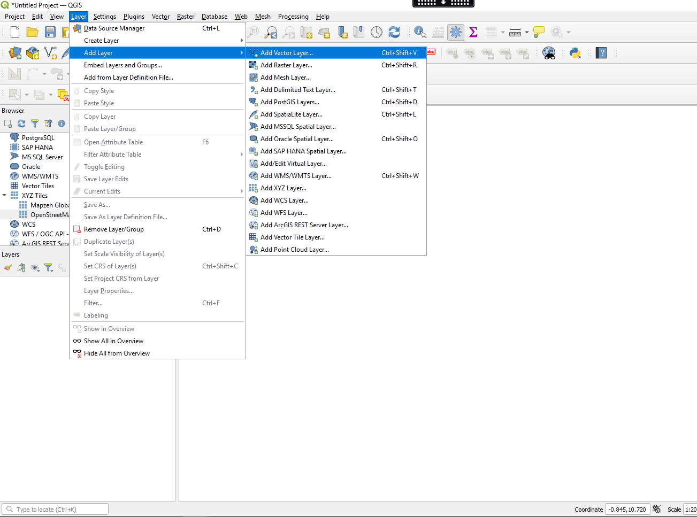
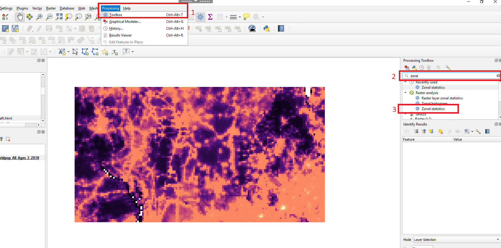
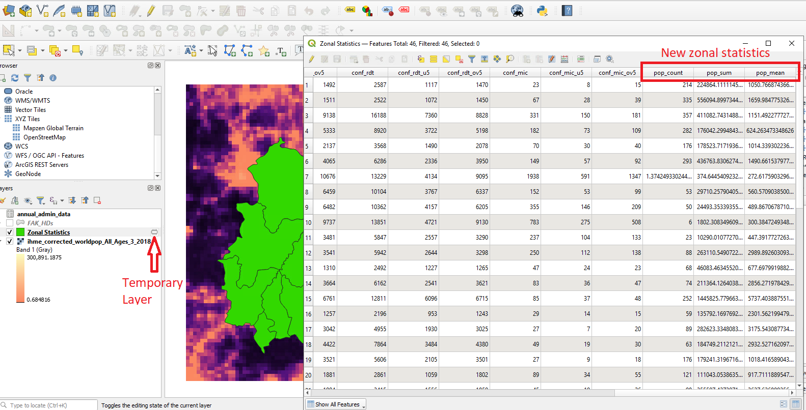
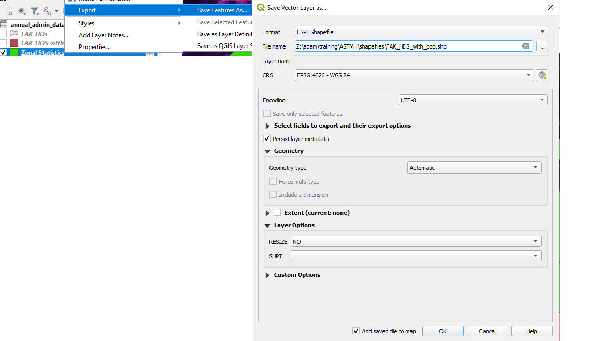
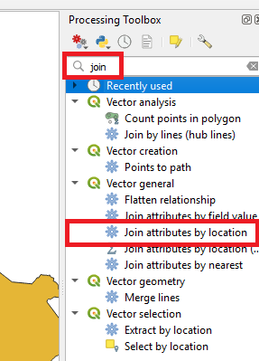
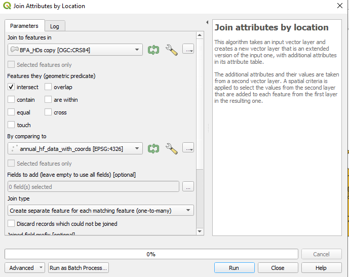
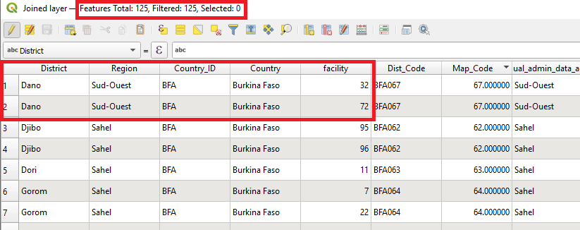
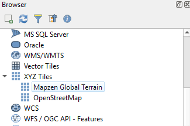
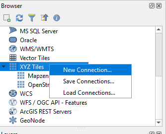

```{r setup, include=FALSE}
knitr::opts_chunk$set(echo = TRUE)
```


```{r ban, echo=FALSE, fig.cap="", out.width = '90%'}
knitr::include_graphics("images/banner.png")
```


# Overview 


In this sessions students will learn the to manage and present spatial data using Geographical Information System (GIS) software. Session 1 introduces students to QGIS with session 2 replicating many of the exercises in R. Both QGIS and R software are free and open-source. 

QGIS is a popular alternative to paid GIS software and provides an interface with other open source GIS such as SAGA and GRASS. It has a large user base and extensive support options with easily accessible tutorials, user guides and forums. Similar to R there are numerous volunteers contributing to the development of QGIS with "Plugins" available for tools to improve functionality. GIS specific software such as QGIS predominantly use a graphical user interface (GUI) - aka pointing and clicking - and so are thought to be more user friendly.  While a little advanced for this module it should be noted that you can run R commands in QGIS and also access QGIS processing functions from R. 

This tutorial will give step by step instructions that the students can use to follow along with the instructor. 

\vspace{15pt}
\renewcommand\contentsname{}
\setcounter{tocdepth}{2}
\hrule
\tableofcontents
\vspace{25pt}
\hrule

## Objectives of tutorial  

- To become familiar with QGIS 
- Adding vector and raster data to your QGIS project
- Explore vector attributes 
- Adding tabular data and joining vector data 
- Creating maps in print composer 

<br>

## QGIS Interface 

On opening QGIS from your computer familiarize yourself with the QGIS interface. Hovering your mouse over symbols will give additional information for most items. 

1. Menu Bar: Provides access to various QGIS features using a standard hierarchical menu.
2. Tool Bar: Provides access to most of the functions as the menus, plus additional tools for interacting with the map.
3. Browser panel: Used to locate, inspect and add data to you project. You are able to browse you own computer and additional resources
4. Map View or Map canvas: The map displayed in this window will depend on the vector and raster layers you have chosen to load. Here you can interact with the map - move the maps, zoom in/out, select features etc 
5. Layers list: lists the layers that have are available in the current project. Hovering over layers will give some basic information. Layers can be toggled on/off here and right clicking on a layer will give several additional options explored later in the tutorial. 
6. Status bar:  The status bar shows you your current position in map coordinates as the mouse pointer is moved across the map view.
7. Processing toolbox: This panel may not be visible when first opening QGIS. It contains many analytic tools used when delving deeper into GIS analysis

Panels can be added and removed from the drop down ***menu bar > View > Panels***


```{r figurename, echo=FALSE, fig.cap="", out.width = '90%', fig.align = 'center'}
knitr::include_graphics("images/qgis_open.png")
```

<br>

## Polygon shapefile components 

Shapefiles are a common file format for vector data and are comprised of multiple files; three that are mandatory and many that are optional:

  - The main file has the extension .shp and contains the feature geometry 
  - .shx files contain the indices of the feature geometry 
  - .dbf files store the attribute data and object IDs. These files can be opened in Microsoft Excel, but cannot be edited there
  - Many shapefiles will also have an optional .prj file that contains metadata for the coordinate and projection system associated with the data

The shapefiles that we will be using for this session are the Fakeland health districts (FAK_HDs) and can be found following folder: **edit when location known. Usb or ... /MAP Spatial Analysis Course/ASTMH/shapefiles/** . We will now learn how to add the shapefiles to GIS, explore the data they contain and join them to non-spatial data. 

```{r figurename3, echo=FALSE, fig.cap="", out.width = '100%', fig.align = 'center'}
knitr::include_graphics("images/fak_hds.png")
```

A detailed description of shapefile components can be found [here](https://www.esri.com/content/dam/esrisites/sitecore-archive/Files/Pdfs/library/whitepapers/pdfs/shapefile.pdf)

<br>

# Adding layers 

There are multiple ways of adding layers to your QGIS project. The numbered bullet points below outline a few options. Try them out after class and see which you prefer. For now we will follow option 1. Note that you should always add the .shp file of the shapefile components.  

<div class="warning" style='padding:0.1em; background-color:#E9D8FD; color:#69337A'>
<span>
<p style='margin-left:1em;'>

1. From the menu bar ***Layer > Add layer > Add Vector Layer***.

```{r add_l, echo=FALSE, fig.cap="", out.width = '100%', fig.align = 'center'}

```

From the popup window click the three dots (indicated <span style="color:red">1</span> below) and navigate to the files you wish to add. 
Click add <span style="color:red">(2)</span> - this will add the shapefiles to QGIS and then you can close the pop-up window <span style="color:red">(3)</span>. 

You may have noticed that there are many different types of layers to add. We use "Add Vector Layer" is for lines and polygons. Later in the tutorial we will also add point data as well as non-geographic tabular data (Delimited text) and raster data.
   

```{r add_l2, echo=FALSE, fig.cap="", out.width = '100%', fig.align = 'center'}
knitr::include_graphics("images/add_layer2.png")
```

</p>
</p></span>
</div>


**Try these options after class:**

2. On the toolbar click the “Open data source manager” icon . The popup window will be the same as option one and so you will follow the same steps, just make sure "vector" is selected on the left hand side. 

3. From the "Browser panel" navigate to the folder the files where the files are located and to add double click on them.  

4. Finally you can simply drag and drop files directly from your computer folder into the map canvas or layers list 

# Exploring the shapefile 


You should now see the Fakeland health districts on your map canvas with each district boundary being represented by a different polygon. Note that when adding layers QGIS will randomly assign colors and your map will be a different color. We will show you how this can be changed shortly but first you can explore the shapefile. 

<div class="warning" style='padding:0.1em; background-color:#E9D8FD; color:#69337A'>
<span>
<p style='margin-left:1em;'>

```{r figurename4, echo=FALSE, fig.cap="", out.width = '100%', fig.align = 'center'}
knitr::include_graphics("images/fak_admin.png")
```


1.  Click on the identify features icon   
2.  Then click on an area of the shapefile. 
3.  You will notice that the area is highlighted in red and information about that particular polygon will be displayed on the right.  We see that the shapefiles contain basic information about the country_id, region name, district name and other id codes useful for identifying administration areas. 
4.  You can move the map by clicking on the pan map icon  and then clicking and holding on the map canvas.
5. You can also zoom in and out with your mouse scroll wheel or trackpad (note these can be very sensitive) or by clicking on the zoom icons . 
6. If the zoom gets a bit out of control and you loose your map it is always possible to recenter your map again by right-clicking on the FAK_HDs in the layer menu and then select "Zoom to layer" 


```{r figurena4, echo=FALSE, fig.cap="", out.width = '70%', fig.align = 'center'}
knitr::include_graphics("images/zoom_layer.png")
```

</p>
</p></span>
</div>


# The attribute table 

Information regarding the features can be found in the attribute table. 

<div class="warning" style='padding:0.1em; background-color:#E9D8FD; color:#69337A'>
<span>
<p style='margin-left:1em;'>

1.  To open the attribute table right click on the layer <span style="color:red">(1)</span> and select . 
2.  Each row in the table represents a feature, and each column is a field (variable) that is associated with the feature. Features in the table can be searched, moved or even edited. Features in the table can be selected and they will be highlighted in yellow on the map canvas. In the example below we have selected Tangue administration 2 unit and the yellow highlight shows us where it is on the map <span style="color:red">(2)</span>. 
3.  Try clicking on other features in the table and explore where they are - to make it easier to see the features selected on the map you can "dock" the attribute table window by clicking on the dock icon . 

```{r att, echo=FALSE, fig.cap="", out.width = '90%', fig.align = 'center'}
knitr::include_graphics("images/att_table2.png")
```


**Next section can be cut if time is an issue**

4. It is also possible to search and select features in the attribute table. Let's select all the Admin 1 units named "East". At the top of the attribute table there is a tool bar - click on the filter by form icon <span style="color:red">(1)</span>. 
5. In the box next to Adm1 <span style="color:red">(2)</span> type "East". 
6. The drop-down menu <span style="color:red">(3)</span> should currently be set on "Contains" - change this to "equals to". Note that "equals to" gives an exact name match. Selecting "Contains" would return any name with east in it such as "North east", "South East" etc
7. Click on "select features" <span style="color:red">(4)</span> and look at the map to see what has been selected. 

```{r cont, echo=FALSE, fig.cap="", out.width = '90%', fig.align = 'center'}
knitr::include_graphics("images/contains.png")
```

8. We can return to the table view for the attribute table by clicking the table view icon in the bottom right hand corner of the attribute table window. 
9. We can then click the symbol  to move all the features we selected to the top of the attribute table. If we look at the Admin1 that have been selected we can see East has been selected
10. You can also zoom in on the area you selected by clicking on  "Zoom to Features" <span style="color:red">(3)</span> 

</p>
</p></span>
</div>

In the previous example we selected features based on a single condition (Adm1). However it is possible to select based on multiple conditions. There are many available tools in the attribute table - for example it is possible to edit the data here and produce new fields with the field calculator.  We will not go through examples here but for further reading please see: [here](https://docs.qgis.org/3.22/en/docs/user_manual/working_with_vector/attribute_table.html?highlight=attribute%20table)

<br>

## Why use selection tools?

The selection of features is a key skill when working in QGIS -  it is essentially used to subset data. For most operations in QGIS there will be a "Use only selected features" tickbox that will apply the operation to your selected subset. Note - there are also certain processing tools that will only apply to the selected features (and apply to all features if none selected) so you have to be aware of your current selection. The toolbar provides a variety of options for selection:

<div class="warning" style='padding:0.1em; background-color:#E9D8FD; color:#69337A'>
<span>
<p style='margin-left:1em;'>

1. We will conduct a basic selection useing the select features tool . First click on the icon
2. On the map canvas you can click on individual features to select them. To select multiple features you can hold down the "ctrl" button on your keyboard. You can also click and drag a selection rectangle that will select all features that it touches. Note that the features you select will also be highlighted in the attribute table. 
3. Finally the simplest way to un-select features is to use the select tool  and click the white space off to the side of the shapefiles 

```{r select, echo=FALSE, fig.cap="", out.width = '90%', fig.align = 'center'}
knitr::include_graphics("images/select.png")
```

</p>
</p></span>
</div>

# Change properties of map

##  Symbology

<div class="warning" style='padding:0.1em; background-color:#E9D8FD; color:#69337A'>
<span>
<p style='margin-left:1em;'>


1. To change color of the map either:
      - Double click on the layer in layers panel <span style="color:red">1</span>
      - OR right click with cursor on the layer and select “properties”

2. Click on symbology <span style="color:red">2</span>
3. Click single symbol <span style="color:red">3</span>, 
4. Click simple fill <span style="color:red">4</span>
5. We can change the colour by clicking on “Fill color” <span style="color:red">5</span> and select the colour of your choice. If you do not want a fill colour click on “Fill style” and choose “No Brush”. You can also adjust the properties of the polygon outline here.
6.  When you are happy with your choice click “Apply” and “OK” <span style="color:red">6</span>. 


```{r figurename5, echo=FALSE, fig.cap="", out.width = '90%', fig.align = 'center'}
knitr::include_graphics("images/props.png")
```

</p>
</p></span>
</div>


<br>

# Adding Point data 

Point data is a very common form of data used in health surveillance and research. In the following example the points represent individual health facilities.

<div class="warning" style='padding:0.1em; background-color:#E9D8FD; color:#69337A'>
<span>
<p style='margin-left:1em;'>


1.  From the menu bar select ***Layers > Add layer > Add delimited text layer***. 
2.  Click the browser icon  and navigate to the file "fakeland_hf_gps" in the "Data" folder.
3. Select "CSV" file format and select "first record has field names" from Record and Fields Options.
4. This file contains point coordinates that can locate the data geographically. We therefore need to select "point coordinates" from the Geometry Definition and from the x and y fields select x and y respectively (terms used instead of x and y are;  latitude and longitude, or North/South and West/East readings). It is a common error to input the coordinates the wrong way around but this should be very obvious from locations of the points on the map canvas 
5. Finally, there will be a preview of the attribute table associated with the gps points. You can make basic changes to the field type here if needed. 
6. Click add and Close 


```{r point1, echo=FALSE, fig.cap="", out.width = '90%', fig.align = 'center'}
knitr::include_graphics("images/point1.png")
```

</p>
</p></span>
</div>


You will now see the points added to map canvas and Each point is a different health facility. Like with the polygon shapefile we can open the attribute table  to see what data is available for each health facility. 

We can explore the malaria data with visualizations.

<div class="warning" style='padding:0.1em; background-color:#E9D8FD; color:#69337A'>
<span>
<p style='margin-left:1em;'>

1.  We outlined how to do this with the admin units could be colored to represent malaria burden - follow the same process for the points.  
2. It is also possible represent the malaria case load by changing the size of the points - hint try changing the "methods" drop-down when in the graduated symbology window **need to include malaria data in points dataset**

</p>
</p></span>
</div>


##  Symbology

<div class="warning" style='padding:0.1em; background-color:#E9D8FD; color:#69337A'>
<span>
<p style='margin-left:1em;'>

1. Following similar steps to changing the symbology of polygons either:
      - Double click on the points layer in layers panel 
      - OR right click with cursor on the points layer and select “properties”

2. Click on symbology 
3. Select Single Symbol from the dropdown menu
4. Click Simple Marker
5.There are multiple options presented from changing the colour and size of the point to changing the shape. For now we can change the colour by clicking on “Fill color”. Note that stroke colour is the colour of the boarder 
6.  When you are happy with your choice click “Apply” and “OK” <span style="color:red">6</span>. 

```{r point2, echo=FALSE, fig.cap="", out.width = '90%', fig.align = 'center'}
knitr::include_graphics("images/point2.png")
```

</p>
</p></span>
</div>


<br>
***Bad points optional extra***
<br>


## Optional Extra - Labeling 

 It is also possible to add labels to the map. 


1.  As before open the properties window.
2.  Under the symbology symbol click on labels.
3.  Select "Single Labels" from the first dropdown menu. 
4.  From the "Value" drop-down select which attribute you want to label the polygons with. For now select "hf". This is the unique health facility id number. 
5. Click "Apply" and "OK" 
6. There are many other style choices for text font, size, color, positioning etc that can be explored here - try a few of them. Note that labeling maps can often lead to busy/cluttered hard to read maps so unless absolutely necessary minimize labeling to main points of interest.  
7. To remove the labels select "no labels" from the original drop-down menu. 


```{r lab, echo=FALSE, fig.align = 'center', fig.cap="", out.width = '90%'}
knitr::include_graphics("images/labels.png")
```


```{r la5, echo=FALSE, fig.cap="",fig.align = 'center', out.width = '90%'}
knitr::include_graphics("images/map_labels.png")
```

<br>

# Layer visibility

If you are new to GIS you may be wondering why we keep referring to the data as "Layers". Maps are often built up from several data sources and types and they have to be layered/stacked in a certain way so that each component can be visualized.

In QGIS the order you see the layers in the layers panel represents the order you will see them on the map canvas (the layers at the top of the list you will see first).  You can rearrange the order of the layers by clicking and dragging. 

<div class="warning" style='padding:0.1em; background-color:#E9D8FD; color:#69337A'>
<span>
<p style='margin-left:1em;'>

You can also turn on/off the layers using the tickbox next to each layer - try un-selecting the points layer. 

</p>
</p></span>
</div>

```{r lau, echo=FALSE, fig.cap="", out.width = '50%', fig.align = 'center'}
knitr::include_graphics("images/layer_pan.png")
```


You will notice that the point data must be on top to the polygon data for it to be visible. Currently we only have two visible layers but maps may contain many layers if there are new shapefiles for roads, waterways, railways, buildings etc. 

<br>

# Saving a project 

<div class="warning" style='padding:0.1em; background-color:#E9D8FD; color:#69337A'>
<span>
<p style='margin-left:1em;'>

1. To save a QGIS project, select “Project” from the top-left corner of the toolbar and click “SAVE AS”.
2. Save it in an appropriate folder and name the project as “MAP_training” and click “SAVE”. 

</p>
</p></span>
</div>

It is important to note that QGIS does not store any data and so when reopening a project QGIS follows the links you provided earlier. If the location of the shapefiles and/or data changes QGIS will be unable to open them.

The project can be reopened from the folder where it was saved or alternatively simply open QGIS and you will see links to previous QGIS projects 


# Data Joins

We regularly work with data that is yet to be linked with a geometry, for example, a table of data containing the number of malaria cases per administrative unit. While this data contains a name for a geographic location it cannot be mapped alone - it needs to be joined  with existing shapefiles of those administration units. 

To join the two data types of data they must have a key shared value (e.g. Admin unit name) and we can conduct what is called an "Attribute Join". We will walk through this below.

An alternative join is the "Spatial join" and can be conducted if both data types are geolocated (for example the tabular data may have GPS locations). This means that a key variable isn’t necessary. You can try a spatial join in the optional extras section. 


## Addtion of tabular data (no geography)

<div class="warning" style='padding:0.1em; background-color:#E9D8FD; color:#69337A'>
<span>
<p style='margin-left:1em;'>

1. First we have to add the tabular data. From the menu bar, click “Add Layer” and then click “Add Delimited Text Layer”. 

```{r csv1, echo=FALSE, fig.cap="", out.width = '90%', fig.align = 'center'}
knitr::include_graphics("images/loadcsv.png")
```


2. Click browser (three black dots) <span style="color:red">1</span> and select the file "annual_admin_data" from the folder Module_4/data/" **Update file path when known**. 
3. In the window that pops up, choose “CSV” under “File Format” <span style="color:red">2</span>, “First record has field names” under “Record and fields Options” <span style="color:red">3</span> and “No geometry (attribute only table)” under “Geometry Definitions” <span style="color:red">4</span>. Note the difference to when we loaded the health facility point data
4. Then click “Add” and “Close” <span style="color:red">5</span>.


```{r csv2, echo=FALSE, fig.cap="", out.width = '90%', fig.align = 'center'}
knitr::include_graphics("images/add_csv.png")
```

</p>
</p></span>
</div>


You will now see  that annual_admin_data has been added to the "Layers panel". Take a look at the data by opening the attribute table . This is an example malaria surveillance dataset. For each Admin 2 unit of Fakland, it outlines the number of malaria tests and confirmed positive results.  The results are broken down by type of test (RDT or Microscopy) and age range of the patients under 5yrs (u5) or over 5yrs (ov5)

```{r csv3, echo=FALSE, fig.cap="", out.width = '50%', fig.align = 'center'}
knitr::include_graphics("images/csv.png")
```

```{r csv4, echo=FALSE, fig.cap="", out.width = '90%', fig.align = 'center'}
knitr::include_graphics("images/ann_att.png")
```

Currently the data is not associated with any geometry so it will not be displayed on the map canvas. We will now join it to the existing Fakeland admin units. 

### Attribute join 

As we have tabular data with no geometry we will have to go with the attribute join. This process will take the tabular data and add it to the attribute table of the shapefile. Before we go onto show you how we do this in practice can you identify the key attributes that we will use to join the data? What attributes do the tabular data and shapefiles have in common?

<div class="warning" style='padding:0.1em; background-color:#E9D8FD; color:#69337A'>
<span>
<p style='margin-left:1em;'>

1.  Double click on the FAK_HDs layer <span style="color:red">1</span> .
2.  On the right hand side where we previously selected symbology and labels - select the "Joins" tab <span style="color:red">2</span> . 
3.  Near the bottom of the window click  <span style="color:red">3</span> to pop up a new window.
4.  In the window, choose “annual_admin_data” from “Join layer” dropdown, "adm2” from the “Join field” and "adm2“ from the Target field” <span style="color:red">4</span> . Note that this will join matching names so the data has to be cleaned beforehand  
5. Select  and delete the prefix "annual_admin_data_" and click OK - If you do not delete this then the prefix will be added to all field names. 
6. Click “Ok” <span style="color:red">6</span>. 
7. The previous window will close - then click “Apply” and “Ok” on Layer Properties. 

```{r j, echo=FALSE, fig.cap="", out.width = '90%', fig.align = 'center'}
knitr::include_graphics("images/att_join.png")
```

Now open the attribute table of the FAK_HDs layer - what do you see? The annual_admin_data malaria data are now included in the FAK_HDs shapfile. 

</p>
</p></span>
</div>


Data sets and shapefiles can then be joined based on attributes such as the name of the administration unit. Note that joining by name can commonly cause errors because differences in spelling, use of capitals or punctuation the names will not be matched - they must be exactly the same.  Data must be clean beforehand but it is also common to join by standardized administrative codes that are less prone to error. 

If you want to know how to conduct a spatial join see the "Optional Extras" at the end of the tutorial 


# Raster data & Zonal statistics  

## Raster data 

We will now see how to load raster data. We will be using a population raster that gives an all age population count for each 5x5km pixel. 

<div class="warning" style='padding:0.1em; background-color:#E9D8FD; color:#69337A'>
<span>
<p style='margin-left:1em;'>

1.  To add raster, select “Layer” from the menu bar
2.  Select “Add Layer” and select “Add Raster Layer”
3.  Choose “ihme_corrected_worldpop_All_Ages_3_2018.tif” from the “Raster” folder
4.  Click Add and Close the window.


```{r rast_1, echo=FALSE, fig.cap="", out.width = '90%', fig.align = 'center'}
knitr::include_graphics("images/rast_1.png")
```

The population raster will appear on the map canvas. It may have covered up the shapefiles - for now this is fine, we can rearrange the layers once we have finished working with the raster. 

By clicking on the small arrow next to the raster on the layer panel you can see the minimum value and maximum values. What can we say about the distribution of the population from this raster? Where are the areas of high and low population density?

Unlike shapefiles there is no attribute table connected to a raster. You can identify the value of an individual raster pixel by clicking the identification icon  and selecting an area of the raster. Currently it is difficult to identify variation in population as most of the raster looks black with few lighter coloured pixels. We can modify the appearance by adjusting the symbology.

</p>
</p></span>
</div>

***too much symbology nonsense - also I don't tend to change rasters anyway - cut next section or keep it as optional***

The steps to change symbology in  a raster layer are different from those explained for vector layer.

1.  Right-click population raster in the layer panel and select “Properties”.
2.  Go to Symbology, choose “Singleband pseudocolor” from the “Render type” dropdown, and your desired coloring from the “Color ramp” dropdown.
3.  Select “Quantile” from the “Mode” dropdown
4.  Click “Classify”. Select Apply and Ok. 


```{r rast1, echo=FALSE, fig.cap="", out.width = '90%', fig.align = 'center'}
knitr::include_graphics("images/symb_raster.png")
```


Why do you think we selected "Quantile" instead of  "Continuous" from the mode drop-down? How has this changed the appearance of the raster? Re-open the Sybmology panel and adjust the number of classes - how does this change the appearance of the map. Note that you can manually adjust the values associated with each level if needed.


```{r rast2, echo=FALSE, fig.cap="", out.width = '90%', fig.align = 'center'}
knitr::include_graphics("images/rast_2.png")
```


## Zonal statistics 

We now have a layer of administrative units and a population raster. Using these two pieces we can calculate the population in each administrative unit - this is know as calculating the zonal statistics. 

<div class="warning" style='padding:0.1em; background-color:#E9D8FD; color:#69337A'>
<span>
<p style='margin-left:1em;'>

1. Go to “Processing” in the menu bar and choose “Toolbox”. A new "processing toolbox" panel will pop-up on the right. 
2. In this panel type “zonal” in the search window and double-click “Zonal statistics”.


```{r zs, echo=FALSE, fig.cap="", out.width = '90%', fig.align = 'center'}

```


3. Choose “FAK_HDs” as the input layer.  “ihme_corrected...” as the raster.  
4. To select the statistics you want to calculate click browse  on the right side of the “Statistics to calculate”. For now we will stick to the pre-selected options (count, sum and mean) however other options are available. 
5. In the output column prefix type "pop_" or your own label - (this will result in output fields (pop_count, pop_sum and pop_mean). It is not absolutely necessary to include a prefix however if you are working with multiple different rasters it becomes important to keep track of the origin of the zonal statistics.  
6. Run and close the window.


```{r zs2, echo=FALSE, fig.cap="", out.width = '90%', fig.align = 'center'}
knitr::include_graphics("images/zone_2.png")
```

7. A new layer “Zonal statistics” will have appeared on the layer panel - it is a copy of the FAK_HDs shapefile however it contains the zonal statistics in is attribute table (Note that some earlier versions of QGIS may attach the zonal statistics directly to the BFA_HDs layer and you will not see this new layer). 
8. Right-click on the “Zonal_Statistics” layer and select “Open Attribute Table”  . You will see the summary statistics at the extreme right of the table. Pop_count = the number of pixels in the feature; Pop_sum = the sum of the pixel values (in this case the total population); Pop_mean = mean of the pixel values (mean population). 

```{r zs3, echo=FALSE, fig.cap="", out.width = '90%', fig.align = 'center'}

```

9. The zonal statistics layer is temporary and will need to be saved as a shapefile for future use. Right-click on “Zonal_Statistics”, then "Export" and click “Save Feature As”. 

```{r zs4, echo=FALSE, fig.cap="", out.width = '100%', fig.align = 'center'}

```

Navigate to the Shapefile folder, give the file name as “FAK_HDs_with_pop” and click Save. Then click Ok.

This will again create a new layer. You can remove the “Zonal_Statistics” from the layer pane by right-clicking and selecting remove layer 

```{r z, echo=FALSE, fig.cap="", out.width = '60%', fig.align = 'center'}
knitr::include_graphics("images/rm_l.png")
```

</p>
</p></span>
</div>


## Field calculator **potential pre-calculate API for mapping if we need to save time** 

We now have population counts and confirmed malaria for each administration unit. Using these two pieces of information we can calculate the Annual Parasite Index (API) that will give a more standardised comparison between administration units. API (per 1000 people) = Number of cases / population * 1000

<div class="warning" style='padding:0.1em; background-color:#E9D8FD; color:#69337A'>
<span>
<p style='margin-left:1em;'>

1. Open the attribute table of the "FAK_HDS_with_pop" layer 
2. Select field calculator from the attribute table menu bar
3. In the field calculator pop-up window fill in the "output field name" with "api" and select the output type. In this case it will be a decimal number.
4. In the expression box you can write the expression you want to carry out. Just type the field names however if you forget what they are called you can use the "fields and values" dropdown menu on the right. As you can see they are many other tools here we can use for calculation 
5. When you are happy your formula is correct click OK. 
6. Navigate to the final column on the right of your attribute table - you should see a column for "api" has been added 

```{r fc2, echo=FALSE, fig.cap="", out.width = '80%', fig.align = 'center'}
knitr::include_graphics("images/field_calc2.png")
```

7. As we have been editing the attribute table the toggle edit icon  will be selected. When we have finished we need to turn off editing by clicking this button - you will then be prompted to save or discard.

```{r fc3, echo=FALSE, fig.cap="", out.width = '80%', fig.align = 'center'}
knitr::include_graphics("images/field_calc3.png")
```

</p>
</p></span>
</div>


## Visualizing API data - Choropleth maps

We will now explore some ways to visualize the data that has been joined. 

<div class="warning" style='padding:0.1em; background-color:#E9D8FD; color:#69337A'>
<span>
<p style='margin-left:1em;'>

1. Right-click on the “FAK_HDs” layer  <span style="color:red">1</span> and select “Properties”. 
2. Go to “Symbology”  <span style="color:red">2</span> 
3. Select “Graduated”  <span style="color:red">3</span>  from the first drop-down
4. Select “api” from the value drop-down  <span style="color:red">4</span>. This is the API we just calculated 
5. You can choose your desired color scheme from the Color ramp drop-down  <span style="color:red">5</span> 
6. Click “Classify”  <span style="color:red">6</span> . The continuous variable "api" will be dived into different bins based on the "mode" selected (see menu above classify) and the number of classes.
7. You can change the number of classes  <span style="color:red">7</span> and you can manually change the value for each class by double clicking on the Values of the classes in the main panel.
8. When you are happy click “Apply” and “Ok”. What does your map look like now?

```{r vis_api, echo=FALSE, fig.cap="", out.width = '90%', fig.align = 'center'}
knitr::include_graphics("images/vis_api.png")
```


```{r vis_api2, echo=FALSE, fig.cap="", out.width = '90%', fig.align = 'center'}
knitr::include_graphics("images/vis_api2.png")
```

We can now see each Admin 2 unit has been colored based on the settings we just established. 

</p>
</p></span>
</div>


# Exporting maps  

## Print layout (previously print composer) 

This session takes you through how to generate and export maps for reporting, publications and presentations. QGIS uses the print layout tool (know as print composer in earlier QGIS versions).


<div class="warning" style='padding:0.1em; background-color:#E9D8FD; color:#69337A'>
<span>
<p style='margin-left:1em;'>

1. You may now have many layers in your QGIS project. We want to have layers we want to visualize to the front or turn off the unwanted layers. We focus will focus on the API map 

2. From the menu bar click on “Project” and then click “New Print Layout”.

```{r print, echo=FALSE, fig.cap="", out.width = '90%', fig.align = 'center'}
knitr::include_graphics("images/print.png")
```

3. From the pop-up window you can name the map or click OK and an automatic name will be created. The print composer window will then open.

4. From the add item menu select “Add map”  menu or use the symbol   on the left pane to add map. 

5. Then left-click on the top left corner, hold and drag to the bottom right corner. Your map will appear in the box you created. 

6. If you want to move the map click the move icon on the left . This will allow you to move the map up/down/left and right but also zoom in and out. You should not confuse this with the zoom icon which changes you view of the map but does not actually change the scale of the map on the print composer. If you want a specific scale or extent you can enter specific settings in the item properties tab on the right  

```{r bfaprint, echo=FALSE, fig.cap="", out.width = '90%', fig.align = 'center'}
knitr::include_graphics("images/fak_print.png")
```

7. Our map is looking a little bare - we can now add features that will give the map some context. Let's first add a legend. Click on the legend icon on the left  and then click and drag on the map where you want the legend.

8. You will see all the items from the Layers panel in the legend - even those that are not visible in the map! We have to clean up the legend and remove labels. In the "Items list" make sure the legend is selected. From there go to the item properties and tick the check box "Only show items inside linked map". This should reduce the legend down to the layers you can see.

```{r leg2, echo=FALSE, fig.cap="", out.width = '90%', fig.align = 'center'}
knitr::include_graphics("images/leg2.png")
```

9.  Alternatively you can manually configure the legend by unchecking the "auto update" box.  For any item you do not want in the legend - select it and click the remove the icon . Repeat this for all the items not useful in the legend

```{r leg3, echo=FALSE, fig.cap="", out.width = '90%', fig.align = 'center'}
knitr::include_graphics("images/leg_remove.png")
```

10. The legend uses the names of layers but these are not always informative. You can change these simply by double clicking on the label in the "Legend Items" panel. Try changeing the FAK_HDs label to something like "Number of confirmed malaria cases" 

11. It should be noted that if you change the layers in the main QGIS project it will be reflected in the print composer. Let's try this out - return to the main QGIS project window (do not close the print window). 

12. Change the color scale of the the FAK_HDs layer then return to the print window. Has the map changed? It may take a moment or you may need to move the map slightly with   so that it updates


13. The map is starting to look better - try adding a North Arrow  and a Scale Bar . Each item on the map has customization options that can be accessed fron the "Item properties" tab - try a few of them out. 

14. Have you added a scale bar? Try to zoom in or out of the map with  and see what happens to the scale bar. 

15. We can also add a text box  for titles or labeling. Text, font size and style are all adjusted in the "item properties" panel. 

```{r text, echo=FALSE, fig.cap="", out.width = '90%', fig.align = 'center'}
knitr::include_graphics("images/text_box.png")
```


16. Once you are happy with an item it is advisable to lock it into place. This will stop any accidental moving/zooming. From the items list - check the box next to "Map 1" with the little lock symbol. 

17. The previous step is mainly used to prevent unwanted moment. We can also lock-in the color symbology so that if you make changes to main map canvas the print layout remains the same. In the "Item properties" of the "Map 1"  check the tickbox for "lock layers" and "lock styles for layers".


```{r lock, echo=FALSE, fig.cap="", out.width = '90%', fig.align = 'center'}
knitr::include_graphics("images/lock.png")
```

18. Return to the main QGIS project and change the color scheme again. What has happens in the print composer now?  

18. There are many different items that can be added to you map such as arrows and tables - find out more [here](https://docs.qgis.org/3.22/en/docs/user_manual/print_composer/composer_items/index.html)

## Exporting maps 

The final step is exporting the map so that it can be used in a report or publication. 

1. To export the map, go to “Layout” and select “Export as image” (note that you can also choose pdf)
2. Choose an appropriate name for the file save in the output folder.
3. You will be prompted to pick a resolutions - 300 dpi is acceptable for most publications
4. Open you map from the folder - how does it look? 

</p>
</p></span>
</div>

## What makes a good map?

Added this section after review - it is not complete but I think important. 

In this tutorial we have focused on the technical requirements for creating maps with QGIS however this is just the first step in creating and informative map. Things to consider when map making:

1. Color. https://colorbrewer2.org/

2. Number of bins/categories 

3. Balance of bins 

4. Missleading maps

Ref? 

## Help and self learning available for QGIS


https://www.qgistutorials.com/en/

https://docs.qgis.org/3.22/en/docs/

https://docs.qgis.org/3.22/en/docs/training_manual/foreword/index.html

https://colorbrewer2.org/

<br>

# Optional Extras (not sure if this is needed? needs updated if remaining)

We are nearing the end of the tutorial - below are a few optional extras you can try if you have time or want to do further study. The options are:

1. Editing the attribute table 
2. Points in polygon  
3. How to do a spatial join 
4. How to include popular background rasters such as Openstreetmap and Google maps 
5. How to access open source spatial data 

<br>

## Attribute table editing 

There are times we may identify errors in the attribute table and may need to correct them. There may also be unwanted columns that you want to tidy up. In the FAK_HDs_with_pop shapefiels we do not have a use for the Pop_count and it can get confused with Pop_sum so it may be best to remove it. 

1. Ooen the FAK_HDs_with_pop attribute table but right-clicking and selecting 
2.From the attribute table window select the toggle edit icon  from the top left corner - this allows edits to occur. 
3. To delete a column we can then click on the  symbol and simply scroll down and select the column to be deleted.
4. While we have editing turned on you can also try to click individual cells of the attribute table. You will be given the option to change the cell contents and is a way to fix and small errors in your dataset. 
5. To turn of editing click the toggle symbol again  . You will be prompted to save or discard your changes - if you are happy click save. Now with the editing turned off try and select the cell contents - you will see it is no longer possible. 

QGIS has many other data cleaning and manipulation functions that can be explored. That said it is not a strength of QGIS and so it can be preferable to clean data in excel or R before using in QGIS.


## Optional extra - Points in polygon 

There are times we may want to know the how many points are in each polygon. In our example it will tell us how many health facilities are in each District but there are many other different use cases. 

1. From the menu bar select ***Vector > Analysis tools > Count in Polygon***


```{r pnp, echo=FALSE, fig.cap="", out.width = '90%', fig.align = 'center'}
knitr::include_graphics("images/pnp.png")
```


2. The pop-up window will prompt you to select a polygon and a point layer. You can change the name of the count field name - try "Num_HFs"
3. Click run
4. A new temporary layer will be produced named "Count". Open the attribute table and inspect the Num_HFs field 
5. Note that this is a temporary layer and will need to be saved if needed in the future


```{r pnp2, echo=FALSE, fig.cap="", out.width = '90%', fig.align = 'center'}
knitr::include_graphics("images/pnp2.png")
```


## Spatial Join 

If we have two layers both with geometry we can combine their attributes with a spatial join. 

1. The the processing toolbox type "join". You will see a option to "Join attribute by location" - double click on this

```{r sp, echo=FALSE, fig.cap="", out.width = '90%', fig.align = 'center'}

```

2. Let's join the heath facility data to the Burkina Faso admin units - remember from the work earlier that there are multiple health facilities in some admin units but none in others so it is not just a matter of joining table columns. In the first dropdown menu "Join to features in" select the "BFA_HDs" layer. In the "By comparing to" menu select the point layer for the health facilities "annual_hf_data_with_coords". 

3. In the "Features they" tickbox - keep the default selection of "intersect". This essentially means you are going to join any point that is in or touching a polygon. For more infoirmation on the different options see:  https://docs.qgis.org/3.22/en/docs/user_manual/processing_algs/qgis/vectorgeneral.html#join-attributes-by-location

4. Finally select the "Join Type" - "Create seperate feature for each matching feature (one to many)" 

5. Click "Run"

```{r sp2, echo=FALSE, fig.cap="", out.width = '90%', fig.align = 'center'}

```

6. A temporary layer named "Joined Layer" will be created. Open the attribute table of that layer - what do you see? How many features are there and how does that compare to the BFA_HDs and Health facility point layers? Notice that for the Administrative areas that contain more that on Health Facility there are now multiple rows of data. For the administrative areas that do not have a health facility the fields joind from the point layer remain NULL

```{r sp3, echo=FALSE, fig.cap="", out.width = '90%', fig.align = 'center'}

```


## Basemaps

1. Background rasters can be added from "XYZ Tiles" in the Browser panel 
2. OpenStreetMap will be available - just double click it to add to your layers list an map canvas

```{r xyz, echo=FALSE, fig.cap="", out.width = '90%', fig.align = 'center'}

```


3. While it is recommended to create your own maps or use opensource options like OpenStreetMap - Google basemaps are also available. To do this you need to right-click on "XYZ Tiles" and select "New Connection"

```{r xyz2, echo=FALSE, fig.cap="", out.width = '90%', fig.align = 'center'}

```

4. In the pop up window copy and paste the URL of the layer you want (see below). Give it an appropriate name and click OK.

5. Note that if you intend to use OpenStreetMaps or Google Maps for any publication they have to be appropriately acknowledged 

The available Google Maps basemaps are:

Roadmap
http://mt0.google.com/vt/lyrs=m&hl=en&x={x}&y={y}&z={z} 

Terrain
http://mt0.google.com/vt/lyrs=p&hl=en&x={x}&y={y}&z={z}

Altered roadmap
http://mt0.google.com/vt/lyrs=r&hl=en&x={x}&y={y}&z={z}

Satellite only
http://mt0.google.com/vt/lyrs=s&hl=en&x={x}&y={y}&z={z}

Terrain only
http://mt0.google.com/vt/lyrs=t&hl=en&x={x}&y={y}&z={z}

Hybrid
http://mt0.google.com/vt/lyrs=y&hl=en&x={x}&y={y}&z={z}


## Open source spatial data 

An extensive list of free spatial data can be found on the [Free GIS Data website](http://freegisdata.rtwilson.com/). Please explore and see if there is anything relevant to your work.

As an example, we can download shapefiles of the Philippines boundaries, roads, rail network and rivers. 

1. Select "DIVA-GIS Country Data" under the "General" heading 
2. Near the top-right of your scree click "Free Spatial Data" and select "country level data" under the subheading Country Level 
3. Select "Philippines" from the Country dropdown, then select "Administrative areas" and click "OK". Save to the appropriate location. 
4. Repeat step 3 to download other shapefiles by changing the "Subject" heading to "inland water", "roads" and "railroads". 

From the [Free GIS Data website](http://freegisdata.rtwilson.com/) we can also obtain population rasters 

1. From the main page scroll down to the "Population" section and select "Worldpop" 
2. In the Worldpop window select "POPULATION DENSITY" from the "DATA" menu. The select "Unconstrained individual countries 2000-2020 (1km resolution)"
3. Type "Philippines" in the search box and you will be able to get the population density data between 2000 and 2020. Choose 2020 data by clicking on the grey box at the end 
4. Choose the file "phi_pd_2020_1km" and save it to an appropriate location 


